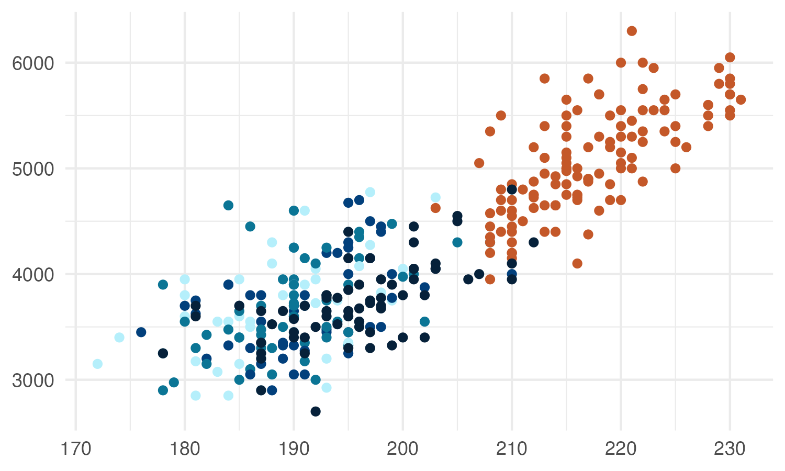
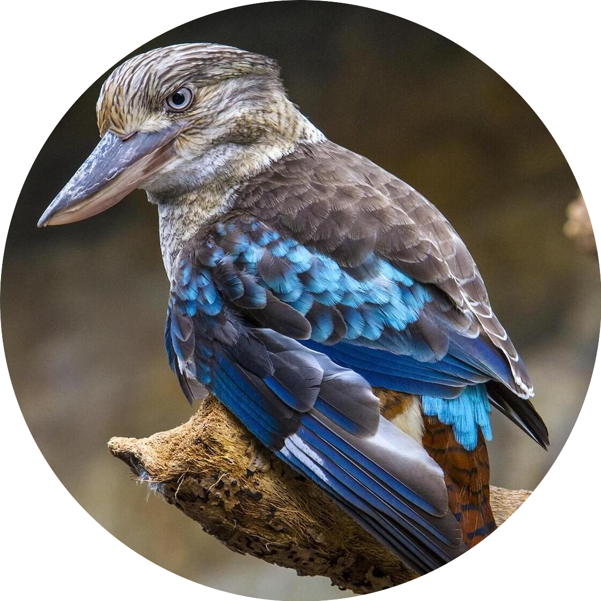

<!-- badges: start -->


<!-- badges: end -->

```{r, include=FALSE}
library(feathers)
library(dplyr)
```

This package contains colour palettes inspired by the plumage of Australian birds. For species exhibiting sexual dimorphism (i.e. males and females look different), I have used female colours. Research on birds has historically been biased towards males, and the choice to use female colours in this package is my way of highlighting the often-overlooked beauty of female birds.

## Installation

This package is hosted on GitHub and can be installed using the devtools package:

```{r, message=FALSE, warning=FALSE, echo = TRUE, results='hide'}
devtools::install_github(repo = "shandiya/feathers", ref = "main")
```

## How to use `feathers`

Colour palettes are stored as a list called `feathers_palettes`, and can be accessed thus:

```{r}
library(feathers)
names(feathers_palettes)
```

`get_pal` returns the chosen palette as a vector of hex colour codes.

```{r}
get_pal("eastern_rosella")
```

`print_pal` displays the colour palette.

```{r, fig.height=1, fig.width=7, fig.align='center'}
eastern_rosella <- get_pal("eastern_rosella")
print_pal(eastern_rosella)
```

## Examples

Colour palettes can be used for data visualisation in base `R` and `ggplot2`.

```{r message=FALSE, warning=FALSE, out.width=c('50%', '50%'), fig.show='hold'}

# base R
library(palmerpenguins)
plot(penguins$flipper_length_mm, penguins$body_mass_g, col = get_pal("rose_crowned_fruit_dove")[factor(penguins$species)], pch = 19)

# ggplot2
library(ggplot2)
library(palmerpenguins)
ggplot(penguins) +
  geom_point(aes(flipper_length_mm, body_mass_g, colour = species)) +
  scale_colour_manual(values = get_pal("rose_crowned_fruit_dove"))

```

## Colour palettes

The images below show each palette and the bird that inspired it.

### Eastern Rosella (*Platycercus eximius*)

```{r rosella_pal, echo = FALSE, message=FALSE, warning=FALSE, fig.height=1, fig.width=7, fig.align='center'}
er <- get_pal("eastern_rosella")
print_pal(er)
```

```{r rosella_img, echo = FALSE, message=FALSE, warning=FALSE, fig.show="hold", out.width=c('65%', '35%')}
knitr::include_graphics("images/eastern_rosella_plot.png")
knitr::include_graphics("images/eastern_rosella_img.png")
```

Image: [Duncan McCaskill](https://commons.wikimedia.org/wiki/File:Platycercus_eximius_-Canberra,_Australia-8.jpg)

### Plains-wanderer (*Pedionomus torquatus*)

```{r wanderer_pal, echo = FALSE, message=FALSE, warning=FALSE, fig.height=1, fig.width=7, fig.align='center'}
pw <- get_pal("plains_wanderer")
print_pal(pw)
```

```{r wanderer_img, echo = FALSE, message=FALSE, warning=FALSE, fig.show="hold", out.width=c('65%', '35%')}
knitr::include_graphics("images/plains_wanderer_plot.png")
knitr::include_graphics("images/plains_wanderer_img.png")
```

Image: [JJ Harrison](https://en.wikipedia.org/wiki/Plains-wanderer#/media/File:Plains-wanderer_female_8173.jpg)

### Spotted Pardalote (*Pardalotus punctatus*)

```{r spotty_pal, echo = FALSE, message=FALSE, warning=FALSE, fig.height=1, fig.width=6, fig.align='center'}
sp <- get_pal("spotted_pardalote")
print_pal(sp)
```

```{r spotty_img, echo = FALSE, message=FALSE, warning=FALSE, fig.show="hold", out.width=c('65%', '35%')}
knitr::include_graphics("images/spotted_pardalote_plot.png")
knitr::include_graphics("images/spotted_pardalote_img.png")
```

Image: [Patrick_K59](https://commons.wikimedia.org/wiki/File:Spotted_Pardalote_(Pardalotus_punctatus)_female_(23113043855).jpg)

### Rose-crowned Fruit-Dove (*Ptilinopus regina*)

```{r rcf_dove_pal, echo = FALSE, message=FALSE, warning=FALSE, fig.height=1, fig.width=8, fig.align='center'}
rcfd <- get_pal("rose_crowned_fruit_dove")
print_pal(rcfd)
```

```{r rcf_dove_img, echo = FALSE, message=FALSE, warning=FALSE, fig.show="hold", out.width=c('65%', '35%')}
knitr::include_graphics("images/rose_crowned_fruit_dove_plot.png")
knitr::include_graphics("images/rose_crowned_fruit_dove_img.png")
```

Image: [Sheba_Also](https://commons.wikimedia.org/wiki/File:Rose_crowned_Fruit_Dove_at_Australia_Zoo-1_(9098717408).jpg)

### Rainbow Bee-eater (*Merops ornatus*)

```{r bee_eater_pal, echo = FALSE, message=FALSE, warning=FALSE, fig.height=1, fig.width=7, fig.align='center'}
be <- get_pal("bee_eater")
print_pal(be)
```

```{r bee_eater_img, echo = FALSE, message=FALSE, warning=FALSE, fig.show="hold", out.width=c('65%', '35%')}
knitr::include_graphics("images/bee_eater_plot.png")
knitr::include_graphics("images/bee_eater_img.png")
```

Image: [Jim Bendon](https://commons.wikimedia.org/wiki/File:Rainbow_bee_eater_m%26f.jpg)  

### Superb Fairy-wren (*Malurus cyaneus*)

```{r superb_fw_pal, echo = FALSE, message=FALSE, warning=FALSE, fig.height=1, fig.width=5, fig.align='center'}
sfw <- get_pal("superb_fairy_wren")
print_pal(sfw)
```

```{r superb_fw_img, echo = FALSE, message=FALSE, warning=FALSE, fig.show="hold", out.width=c('65%', '35%')}
knitr::include_graphics("images/superb_fairy_wren_plot.png")
knitr::include_graphics("images/superb_fairy_wren_img.png")
```

Image: [Patrick_K59](https://commons.wikimedia.org/wiki/File:Superb_Fairy-wren_(Malurus_cyaneus)_(18115879009).jpg)

### Princess Parrot (*Polytelis alexandrae*)

```{r princess_pal, echo = FALSE, message=FALSE, warning=FALSE, fig.height=1, fig.width=8, fig.align='center'}
pp <- get_pal("princess_parrot")
print_pal(pp)
```

```{r princess_img, echo = FALSE, message=FALSE, warning=FALSE, fig.show="hold", out.width=c('65%', '35%')}
knitr::include_graphics("images/princess_parrot_plot.png")
```

### Olive-backed Oriole (*Oriolus sagittatus*)

```{r oriole_pal, echo = FALSE, message=FALSE, warning=FALSE, fig.height=1, fig.width=10, fig.align='center'}
oriole <- get_pal("oriole")
print_pal(oriole)
```

```{r oriole_img, echo = FALSE, message=FALSE, warning=FALSE, fig.show="hold", out.width=c('65%', '35%')}
knitr::include_graphics("images/oriole_plot.png")
knitr::include_graphics("images/oriole_img.png")
```

Image: [Patrick_K59](https://commons.wikimedia.org/wiki/File:Olive-backed_Oriole_(Oriolus_sagittatus)_(16640844194).jpg)

### Southern Cassowary (*Casuarius casuarius*)

```{r cassowary_pal, echo = FALSE, message=FALSE, warning=FALSE, fig.height=1, fig.width=8, fig.align='center'}
cass <- get_pal("cassowary")
print_pal(cass)
```

```{r cassowary_img, echo = FALSE, message=FALSE, warning=FALSE, fig.show="hold", out.width=c('65%', '35%')}
knitr::include_graphics("images/cassowary_plot.png")
knitr::include_graphics("images/cassowary_img.png")
```

Image: [Nick Hobgood](https://commons.wikimedia.org/wiki/File:Casuarius_casuarius_Southern_Cassowary_Papua_New_Guinea_by_Nick_Hobgood.jpg)

### Eastern Yellow Robin (*Eopsaltria australis*)

```{r yellow_robin_pal, echo = FALSE, message=FALSE, warning=FALSE, fig.height=1, fig.width=8, fig.align='center'}
robin <- get_pal("yellow_robin")
print_pal(robin)
```

```{r yellow_robin_img, echo = FALSE, message=FALSE, warning=FALSE, fig.show="hold", out.width=c('65%', '35%')}
knitr::include_graphics("images/yellow_robin_plot.png")
knitr::include_graphics("images/yellow_robin_img.png")
```

Image: [Patrick_K59](https://commons.wikimedia.org/wiki/File:Eastern_Yellow_Robin_(Eopsaltria_australis)_(42280188404).jpg)

### Galah (*Eolophus roseicapilla*)

```{r galah_pal, echo = FALSE, message=FALSE, warning=FALSE, fig.height=1, fig.width=7, fig.align='center'}
gal <- get_pal("galah")
print_pal(gal)
```

```{r galah_img, echo = FALSE, message=FALSE, warning=FALSE, fig.show="hold", out.width=c('65%', '35%')}
knitr::include_graphics("images/galah_plot.png")
knitr::include_graphics("images/galah_img.png")
```

Image: [Calistemon](https://commons.wikimedia.org/wiki/File:Galah_(Eolophus_roseicapilla)_at_Coalseam_Conservation_Park,_August_2022_16.jpg)

### Blue-winged Kookaburra (*Dacelo leachii*)

```{r kookaburra_pal, echo = FALSE, message=FALSE, warning=FALSE, fig.height=1, fig.width=7, fig.align='center'}
bwk <- get_pal("blue_winged_kookaburra")
print_pal(bwk)
```

```{r kookaburra_img, echo = FALSE, message=FALSE, warning=FALSE, fig.show="hold", out.width=c('65%', '35%')}


```
Image: [John](https://www.flickr.com/photos/shebalso/11337227556/in/photolist-2mWFnMb-igQfLC-2aSw5uf-2jxyurH-q9r9LK-VSnLoi-2mcjA2N-5KRRVT-2oCTQJh-2mjJ685-DU4FfS-2ofmTCz-2hi8qRh-2hghLqs-23gz7rr-yon4md-2bofh1K-kXBzxo-A34jVg-28fcawR-2hrwP4R-2juUSdh-YkAhR6-2jqMbhn-y9yM9T-iiJDCt-2qgJVXi-2mo3wn9-2gbbMcF-2q8d7hu-277w86E-q6DfTb-2jvGzte-2euVCEo-io3es5-2grAQNb-q6mtLN-2nKKNP9-2oEzST2-hq9DEN-qprXxi-2jA8yQM-6fESCG-dxQfzW-2hsTGor-2jgzQvW-25cVNG2-2nDAUjr-io362g-2gdqPYu/)

## Continuous palettes

The qualitative colour palettes in `feathers` may be converted into sequential or diverging palettes for different types of data visualisation using the `colorRampPalette()` function.

### Sequential palette

```{r, results = FALSE}
# choose end colours
seq_col <- get_pal("eastern_rosella")[c(2,7)]  

# create a gradient of 50 shades in between the selected colours 
colorRampPalette(seq_col)(50)
```

```{r, echo = FALSE, fig.height=2, fig.width=10, fig.align='center'}
print_pal(colorRampPalette(seq_col)(50))
```

### Diverging palette

```{r, results = FALSE}
# choose end and middle colours
div_col <- get_pal("oriole")[c(1,5,10)]

# create a gradient of 50 shades in between the selected colours 
colorRampPalette(div_col)(50)
```

```{r, echo = FALSE, fig.height=2, fig.width=10, fig.align='center'}
print_pal(colorRampPalette(div_col)(50))
```

## Accessibility

There are many tools and packages which simulate different types of colour vision deficiency, such as [Viz Palette](https://projects.susielu.com/viz-palette), [colorblindcheck](https://jakubnowosad.com/colorblindcheck/index.html), [prismatic](https://emilhvitfeldt.github.io/prismatic/), and [colorblindr](https://github.com/clauswilke/colorblindr). You may find these helpful in guiding your decisions about which colours to include in your visualisation to make it accessible to as many people as possible. Happy plotting!

## Julia Port

These colour palettes are now available in Julia as part of the default colour schemes ([ColorSchemes.jl](https://github.com/JuliaGraphics/ColorSchemes.jl/)). Use these colour palettes as you would any other built-in Julia colour scheme:  

```
using ColorSchemes
colorscheme[:cassowary] # or your bird of choice
```

## Contribute

If you would like to contribute to this package or have suggestions for improvement, please [contact me on Bluesky](https://bsky.app/profile/shandiya.bsky.social) or submit a pull request.
