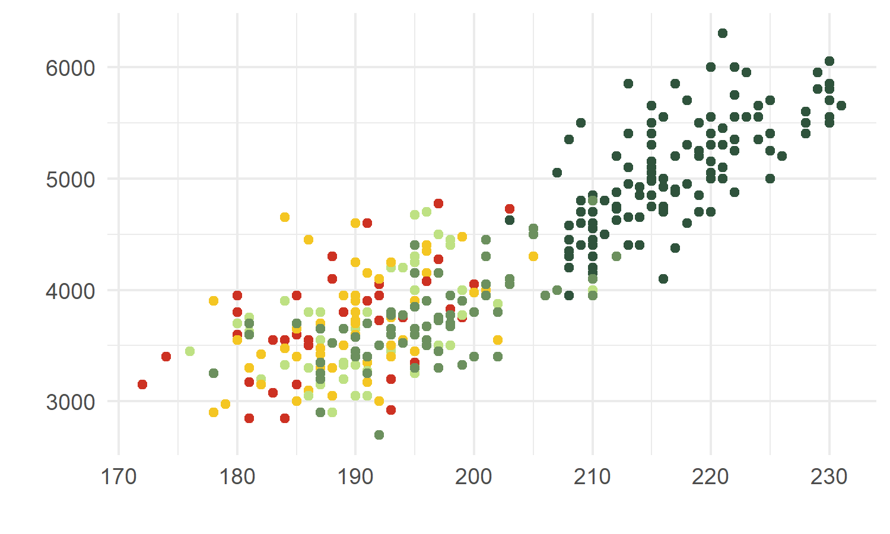
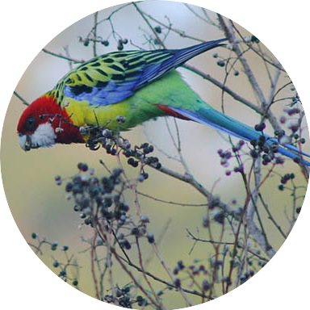
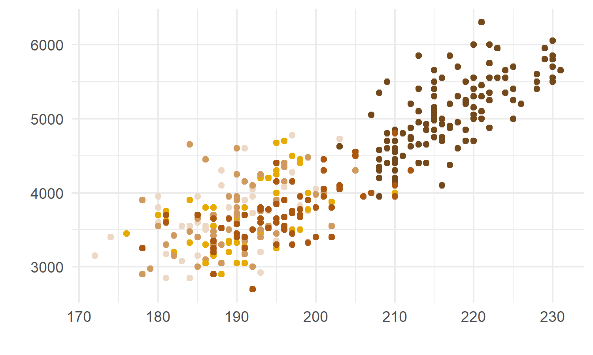
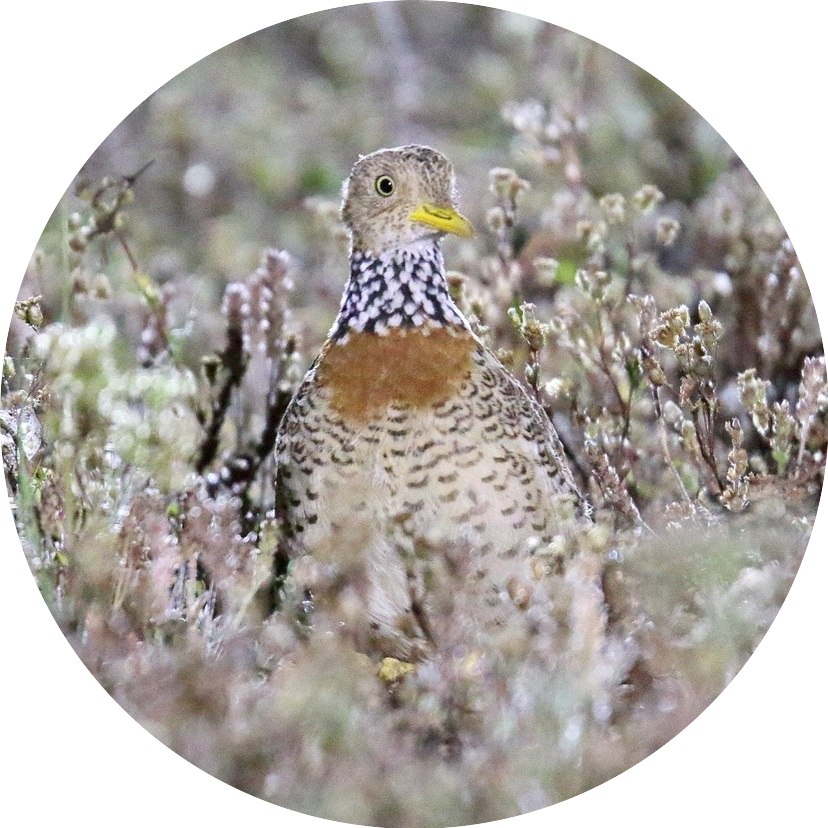
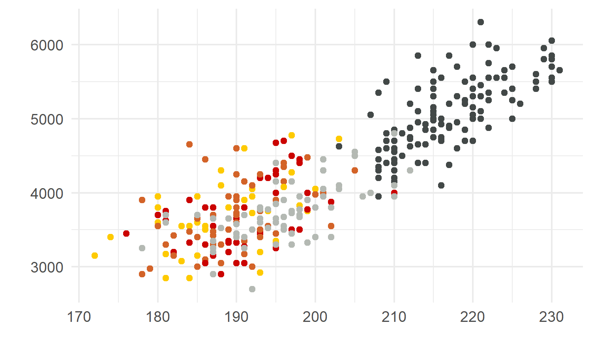
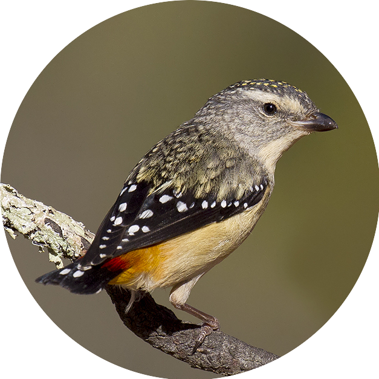
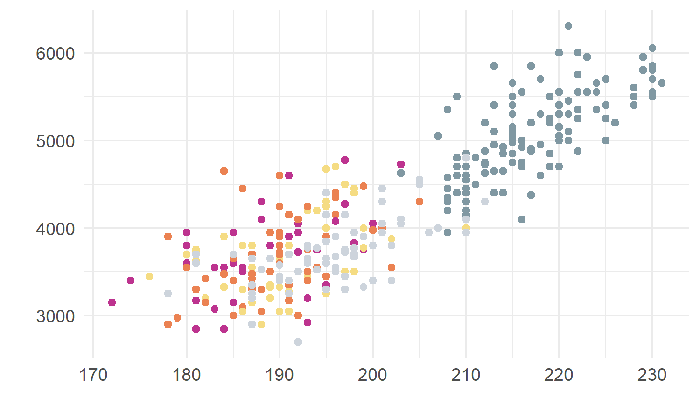
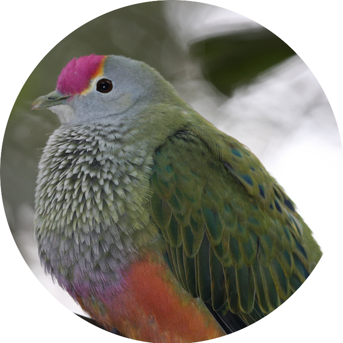
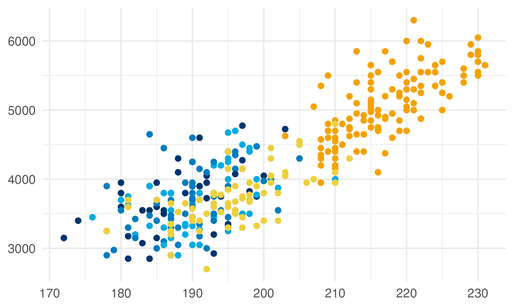
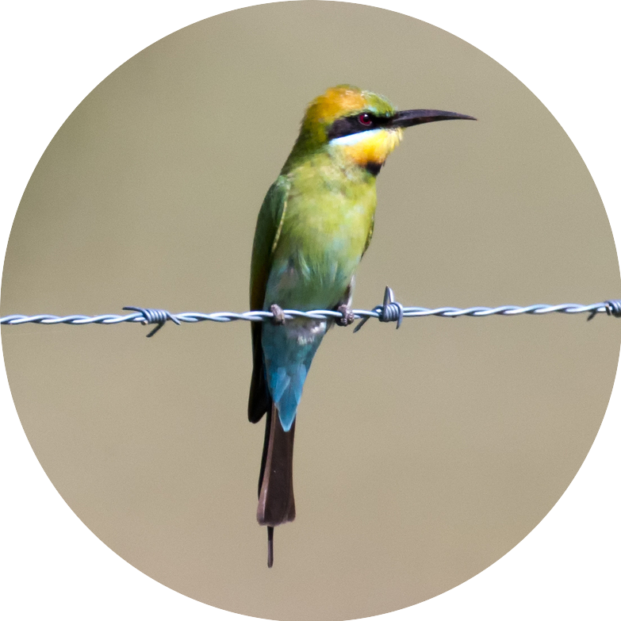

```{r, include=FALSE}
library(feather)
library(dplyr)
```

This package contains colour palettes inspired by the plumage of Australian birds. For species exhibiting sexual dimorphism (i.e. males and females look different), I have used female colours. Research on birds has historically been biased towards males, and the choice to use female colours in this package is my way of highlighting the often-overlooked beauty of female birds.  


## Installation

This package is hosted on GitHub and can be installed using the devtools package:

```{r, message=FALSE, warning=FALSE}
devtools::install_github("shandiya/feather")
```


## How to use `feather`

Colour palettes are stored as a list called `feather_palettes`, and can be accessed thus:

```{r}
library(feather)
names(feather_palettes)
```

`get_pal` is a function that returns the chosen palette as a vector of hex colour codes.

```{r}
get_pal("eastern_rosella")
```

`print_pal` is a function that displays the colour palette in the plots pane.

```{r, fig.height=1, fig.width=7, fig.align='center'}
eastern_rosella <- get_pal("eastern_rosella")
print_pal(eastern_rosella)
```

## Examples

Colour palettes can be used for data visualisation in base `R` and `ggplot2`.

```{r message=FALSE, warning=FALSE, out.width=c('50%', '50%'), fig.show='hold'}

# base R
library(palmerpenguins)
plot(penguins$flipper_length_mm, penguins$body_mass_g, col = get_pal("rose_crowned_fruit_dove")[factor(penguins$species)], pch = 19)

# ggplot2
library(ggplot2)
library(palmerpenguins)
ggplot(penguins) +
  geom_point(aes(flipper_length_mm, body_mass_g, colour = species)) +
  scale_colour_manual(values = get_pal("rose_crowned_fruit_dove"))

```

## Colour palettes

The images below show each palette and the bird that inspired it. 

### Eastern Rosella (*Platycercus eximius*)

```{r rosella_pal, echo = FALSE, message=FALSE, warning=FALSE, fig.height=1, fig.width=7, fig.align='center'}
er <- get_pal("eastern_rosella")
print_pal(er)
```

```{r rosella_img, echo = FALSE, message=FALSE, warning=FALSE, fig.show="hold", out.width=c('65%', '35%')}


```  
Image: [Mfunnell](https://commons.wikimedia.org/wiki/File:Eastern_Rosella_(Platycercus_eximius)_in_tree.jpg)


### Plains-wanderer (*Pedionomus torquatus*)

```{r wanderer_pal, echo = FALSE, message=FALSE, warning=FALSE, fig.height=1, fig.width=7, fig.align='center'}
pw <- get_pal("plains_wanderer")
print_pal(pw)
```

```{r wanderer_img, echo = FALSE, message=FALSE, warning=FALSE, fig.show="hold", out.width=c('65%', '35%')}


```  
Image: [Dominic Sherony](https://commons.wikimedia.org/wiki/File:Plains-wanderer_(Pedionomus_torquatus)_7_(30547426803).jpg)


### Spotted Pardalote (*Pardalotus punctatus*)

```{r spotty_pal, echo = FALSE, message=FALSE, warning=FALSE, fig.height=1, fig.width=6, fig.align='center'}
sp <- get_pal("spotted_pardalote")
print_pal(sp)
```

```{r spotty_img, echo = FALSE, message=FALSE, warning=FALSE, fig.show="hold", out.width=c('65%', '35%')}


```  
Image: [Patrick_K59](https://commons.wikimedia.org/wiki/File:Spotted_Pardalote_(Pardalotus_punctatus)_female_(23113043855).jpg)


### Rose-crowned Fruit-Dove (*Ptilinopus regina*)

```{r rcf_dove_pal, echo = FALSE, message=FALSE, warning=FALSE, fig.height=1, fig.width=8, fig.align='center'}
rcfd <- get_pal("rose_crowned_fruit_dove")
print_pal(rcfd)
```

```{r rcf_dove_img, echo = FALSE, message=FALSE, warning=FALSE, fig.show="hold", out.width=c('65%', '35%')}


```  
Image: [Moonlight0551](https://commons.wikimedia.org/wiki/File:Rose-crowned_Fruit-Dove_-_Ptilinopus_regina_(7088988107).jpg)


### Rainbow Bee-eater (*Merops ornatus*)

```{r bee_eater_pal, echo = FALSE, message=FALSE, warning=FALSE, fig.height=1, fig.width=7, fig.align='center'}
be <- get_pal("bee_eater")
print_pal(be)
```

```{r bee_eater_img, echo = FALSE, message=FALSE, warning=FALSE, fig.show="hold", out.width=c('65%', '35%')}


```  

Image: [Jim Bendon](https://commons.wikimedia.org/wiki/File:Rainbow_bee_eater_m%26f.jpg)


## Continuous palettes

The qualitative colour palettes in `feather` may be converted into sequential or diverging palettes for different types of data visualisation using the `colorRampPalette()` function.  

### Sequential palette  

```{r, results = FALSE}
# choose end colours
seq_col <- get_pal("eastern_rosella")[c(2,7)]

# create a gradient of 50 shades in between the selected colours 
colorRampPalette(seq_col)(50)
```

```{r, echo = FALSE, fig.height=3, fig.width=5, fig.align='center'}
print_pal(colorRampPalette(seq_col)(50))
```


### Diverging palette  

```{r, results = FALSE}
# choose end and middle colours
div_col <- get_pal("oriole")[c(1,5,10)]

# create a gradient of 50 shades in between the selected colours 
colorRampPalette(div_col)(50)
```

```{r, echo = FALSE, fig.height=3, fig.width=5, fig.align='center'}
print_pal(colorRampPalette(div_col)(50))
```


## Contribute

If you would like to contribute to this package or have suggestions for improvement, please contact [ShandiyaB](https://twitter.com/ShandiyaB) on Twitter or submit a pull request. 


