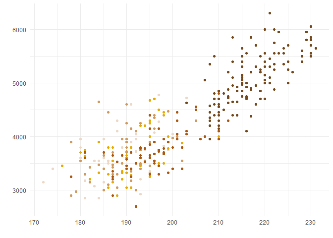
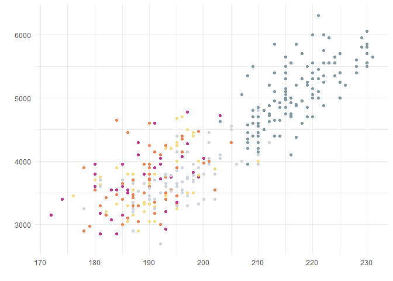
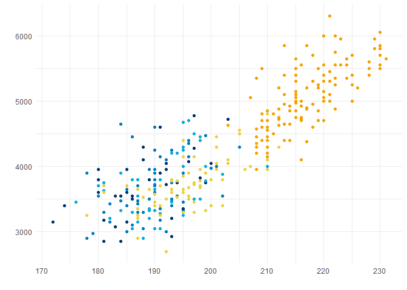

feather
================

This package contains a selection of colour palettes inspired by the
plumage of Australian birds.

## Installation

This package is hosted on GitHub and can be installed using the devtools
package:

``` r
devtools::install_github("shandiya/feather")
```

## How to use `feather`

Colour palettes are stored as a list called `feather_palettes`, and can
be accessed thus:

``` r
library(feather)
names(feather_palettes)
```

    ## [1] "spotted_pardalote"       "plains_wanderer"        
    ## [3] "bee_eater"               "rose_crowned_fruit_dove"
    ## [5] "eastern_rosella"         "oriole"                 
    ## [7] "princess_parrot"

`get_pal` is a function that returns the chosen palette as a vector of
hex colour codes.

``` r
get_pal("eastern_rosella")
```

    ## [1] "#cd3122" "#f4c623" "#bee183" "#6c905e" "#2f533c" "#b8c9dc" "#2f7ab9"

`print_pal` is a function that displays the colour palette in the plots
pane.

``` r
eastern_rosella <- get_pal("eastern_rosella")
print_pal(eastern_rosella)
```


## Examples

Colour palettes can be used for data visualisation in base `R` and
`ggplot2`.

``` r
# base R
library(palmerpenguins)
plot(penguins$flipper_length_mm, penguins$body_mass_g, col = get_pal("rose_crowned_fruit_dove")[factor(penguins$species)], pch = 19)

# ggplot2
library(ggplot2)
library(palmerpenguins)
ggplot(penguins) +
  geom_point(aes(flipper_length_mm, body_mass_g, colour = species)) +
  scale_colour_manual(values = get_pal("rose_crowned_fruit_dove"))
```


## Colour palettes

The images below show each palette and the bird that inspired it.

### Eastern Rosella (*Platycercus eximius*)


<span style="color: grey; font-size: 8pt">Image credit: [JJ
Harrison](https://commons.wikimedia.org/wiki/File:Platycercus_eximius_diemenensis_male.jpg),
licensed under the [Creative
Commons](https://en.wikipedia.org/wiki/Creative_Commons)
[Attribution-Share Alike 3.0 Unported
license](https://creativecommons.org/licenses/by-sa/3.0/deed.en).</span>

### Plains-wanderer (*Pedionomus torquatus*)


<span style="color: grey; font-size: 8pt">Image credit: [Dominic
Sherony](https://commons.wikimedia.org/wiki/File:Plains-wanderer_\(Pedionomus_torquatus\)_7_\(30547426803\).jpg),
licensed under the [Creative
Commons](https://en.wikipedia.org/wiki/Creative_Commons)
[Attribution 2.0
Generic](https://creativecommons.org/licenses/by/2.0/deed.en)
license.</span>

### Spotted Pardalote (*Pardalotus punctatus*)


<span style="color: grey; font-size: 8pt">Image credit:
[Patrick\_K59](https://commons.wikimedia.org/wiki/File:Spotted_Pardalote_\(Pardalotus_punctatus\)_male_\(19205338781\).jpg),
licensed under the [Creative
Commons](https://en.wikipedia.org/wiki/Creative_Commons)
[Attribution 2.0
Generic](https://creativecommons.org/licenses/by/2.0/deed.en)
license.</span>

### Rose-crowned Fruit-Dove (*Ptilinopus regina*)


<span style="color: grey; font-size: 8pt">Image credit:
[Sheba\_Also](https://commons.m.wikimedia.org/wiki/File:Rose_crowned_Fruit_Dove_at_Australia_Zoo-1_\(9098717408\).jpg),
licensed under the [Creative
Commons](https://en.wikipedia.org/wiki/Creative_Commons)
[Attribution 2.0
Generic](https://creativecommons.org/licenses/by/2.0/deed.en)
license.</span>

### Rainbow Bee-eater (*Merops ornatus*)


<span style="color: grey; font-size: 8pt">Image credit: [Jim
Bendon](https://commons.wikimedia.org/wiki/File:Rainbow_bee_eater_\(9847155264\).jpg),
licensed under the [Creative
Commons](https://en.wikipedia.org/wiki/Creative_Commons)
[Attribution 2.0
Generic](https://creativecommons.org/licenses/by/2.0/deed.en)
license.</span>

### Olive-backed Oriole (*Oriolus sagittatus*)


<span style="color: grey; font-size: 8pt">Image credit: [Duncan
McCaskill](https://commons.wikimedia.org/wiki/File:Oriolus_sagittatus_-Canberra,_Australia-8a.jpg),
licensed under the [Creative
Commons](https://en.wikipedia.org/wiki/Creative_Commons)
[Attribution-Share Alike 3.0 Unported
license](https://creativecommons.org/licenses/by-sa/3.0/deed.en).</span>

### Princess Parrot (*Polytelis alexandrae*)


<span style="color: grey; font-size: 8pt">Image credit:
[Timothychacko](https://commons.wikimedia.org/wiki/File:Princess_Parrot_HD_pic.JPG),
licensed under the [Creative
Commons](https://en.wikipedia.org/wiki/Creative_Commons)
[Attribution-Share Alike 4.0 International
license.](https://creativecommons.org/licenses/by-sa/4.0/deed.en).</span>

## Continuous palettes

The qualitative colour palettes in `feather` may be converted into
sequential or diverging palettes for different types of data
visualisation using the `colorRampPalette()` function.

### Sequential palette

``` r
# choose end colours
seq_col <- get_pal("eastern_rosella")[c(2,7)]

# create a gradient of 50 shades in between the selected colours 
colorRampPalette(seq_col)(50)
```


### Diverging palette

``` r
# choose end and middle colours
div_col <- get_pal("oriole")[c(1,5,10)]

# create a gradient of 50 shades in between the selected colours 
colorRampPalette(div_col)(50)
```


## Contribute

If you would like to contribute to this package or have suggestions for
improvement, please contact [ShandiyaB](https://twitter.com/ShandiyaB)
on Twitter or submit a pull request.
