feathers
================

<!-- badges: start -->


<!-- badges: end -->

This package contains colour palettes inspired by the plumage of
Australian birds. For species exhibiting sexual dimorphism (i.e. males
and females look different), I have used female colours. Research on
birds has historically been biased towards males, and the choice to use
female colours in this package is my way of highlighting the
often-overlooked beauty of female birds.

## Installation

This package is hosted on GitHub and can be installed using the devtools
package:

``` r
devtools::install_github(repo = "shandiya/feathers", ref = "main")
```

## How to use `feathers`

Colour palettes are stored as a list called `feathers_palettes`, and can
be accessed thus:

``` r
library(feathers)
names(feathers_palettes)
```

    ##  [1] "spotted_pardalote"       "plains_wanderer"        
    ##  [3] "bee_eater"               "rose_crowned_fruit_dove"
    ##  [5] "eastern_rosella"         "oriole"                 
    ##  [7] "princess_parrot"         "superb_fairy_wren"      
    ##  [9] "cassowary"               "yellow_robin"           
    ## [11] "galah"

`get_pal` returns the chosen palette as a vector of hex colour codes.

``` r
get_pal("eastern_rosella")
```

    ## [1] "#cd3122" "#f4c623" "#bee183" "#6c905e" "#2f533c" "#b8c9dc" "#2f7ab9"

`print_pal` displays the colour palette.

``` r
eastern_rosella <- get_pal("eastern_rosella")
print_pal(eastern_rosella)
```


## Examples

Colour palettes can be used for data visualisation in base `R` and
`ggplot2`.

``` r
# base R
library(palmerpenguins)
plot(penguins$flipper_length_mm, penguins$body_mass_g, col = get_pal("rose_crowned_fruit_dove")[factor(penguins$species)], pch = 19)

# ggplot2
library(ggplot2)
library(palmerpenguins)
ggplot(penguins) +
  geom_point(aes(flipper_length_mm, body_mass_g, colour = species)) +
  scale_colour_manual(values = get_pal("rose_crowned_fruit_dove"))
```


## Colour palettes

The images below show each palette and the bird that inspired it.

### Eastern Rosella (*Platycercus eximius*)


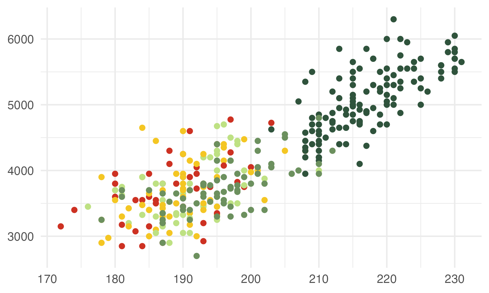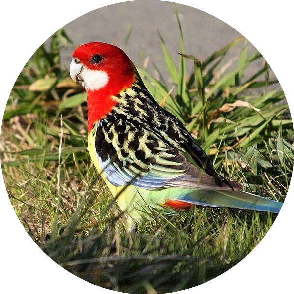

Image: [Duncan
McCaskill](https://commons.wikimedia.org/wiki/File:Platycercus_eximius_-Canberra,_Australia-8.jpg)

### Plains-wanderer (*Pedionomus torquatus*)


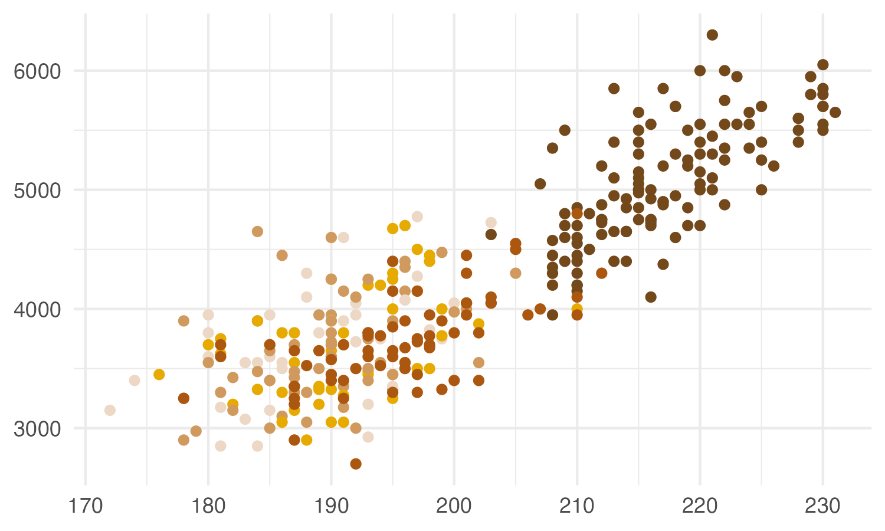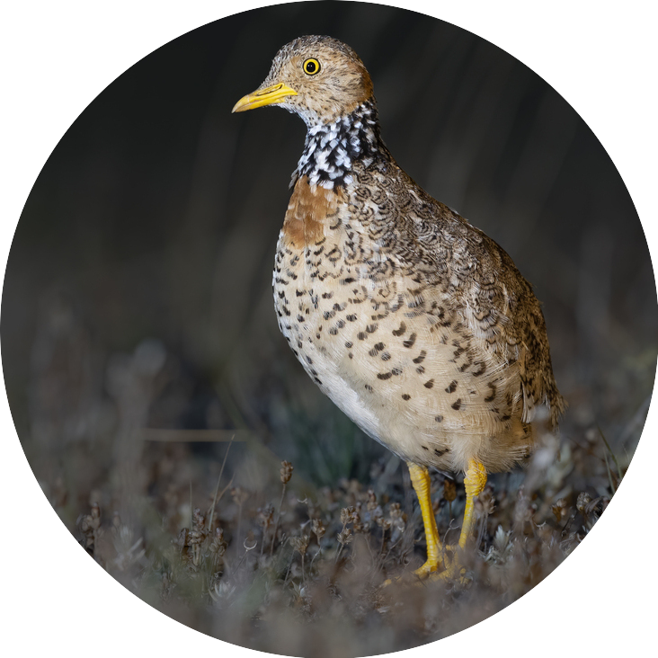

Image: [JJ
Harrison](https://en.wikipedia.org/wiki/Plains-wanderer#/media/File:Plains-wanderer_female_8173.jpg)

### Spotted Pardalote (*Pardalotus punctatus*)


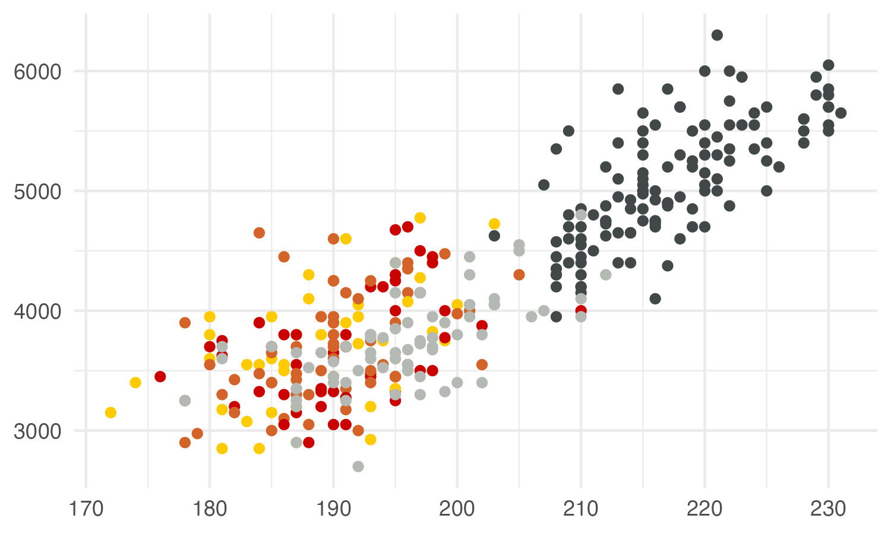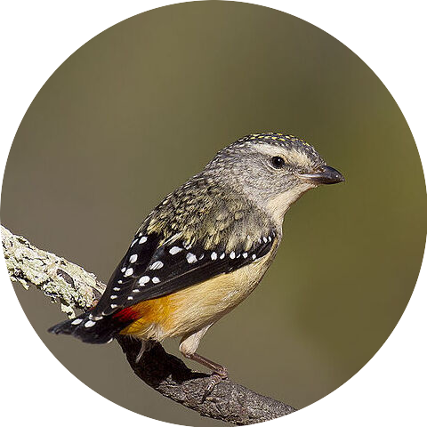

Image:
[Patrick_K59](https://commons.wikimedia.org/wiki/File:Spotted_Pardalote_(Pardalotus_punctatus)_female_(23113043855).jpg)

### Rose-crowned Fruit-Dove (*Ptilinopus regina*)


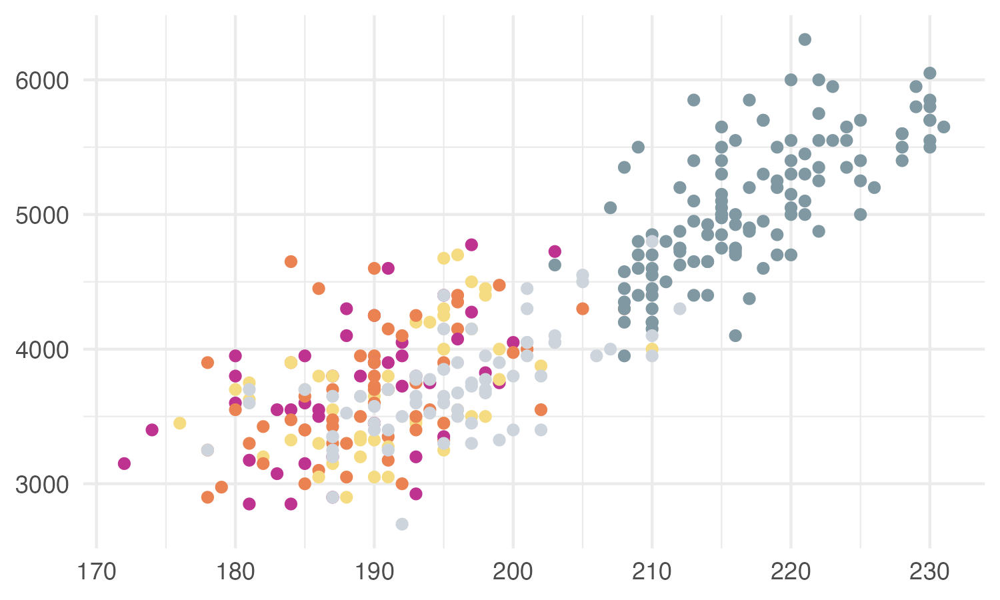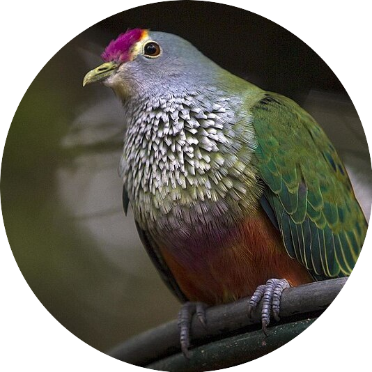

Image:
[Sheba_Also](https://commons.wikimedia.org/wiki/File:Rose_crowned_Fruit_Dove_at_Australia_Zoo-1_(9098717408).jpg)

### Rainbow Bee-eater (*Merops ornatus*)


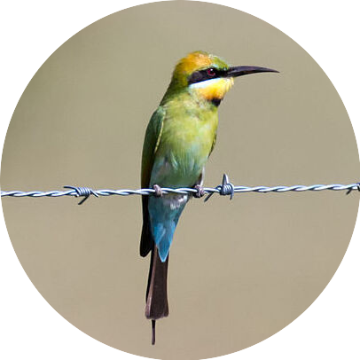

Image: [Jim
Bendon](https://commons.wikimedia.org/wiki/File:Rainbow_bee_eater_m%26f.jpg)

### Superb Fairy-wren (*Malurus cyaneus*)


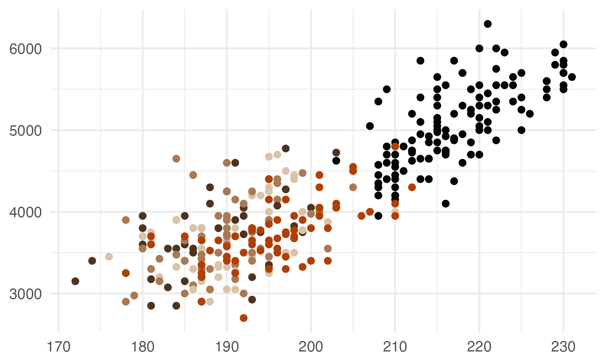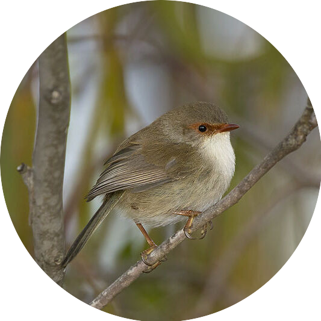

Image:
[Patrick_K59](https://commons.wikimedia.org/wiki/File:Superb_Fairy-wren_(Malurus_cyaneus)_(18115879009).jpg)

### Princess Parrot (*Polytelis alexandrae*)


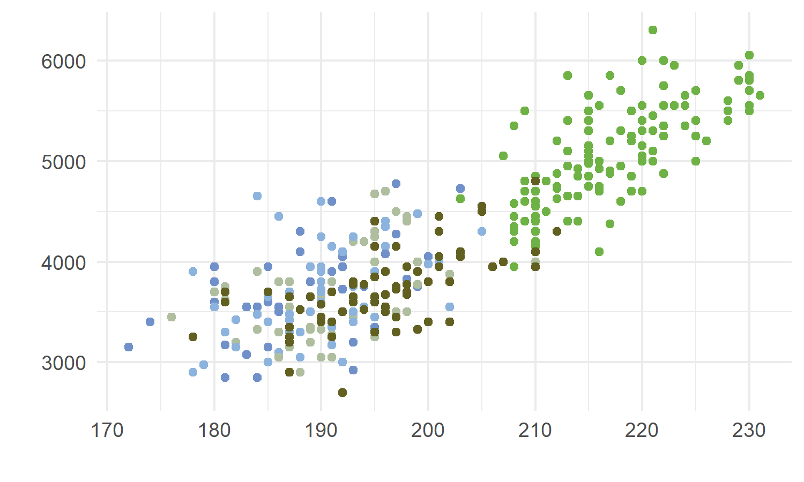

### Olive-backed Oriole (*Oriolus sagittatus*)


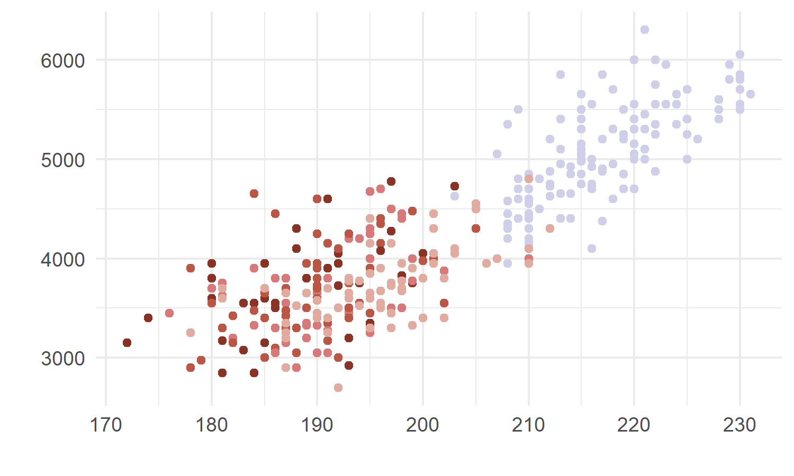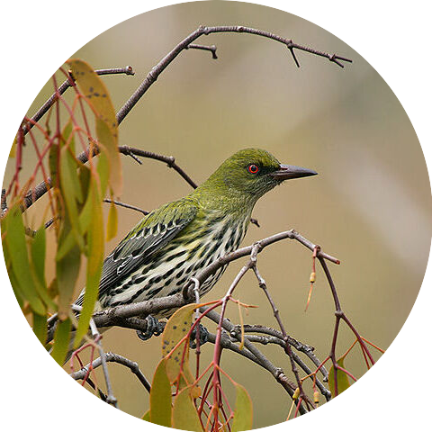

Image:
[Patrick_K59](https://commons.wikimedia.org/wiki/File:Olive-backed_Oriole_(Oriolus_sagittatus)_(16640844194).jpg)

### Southern Cassowary (*Casuarius casuarius*)


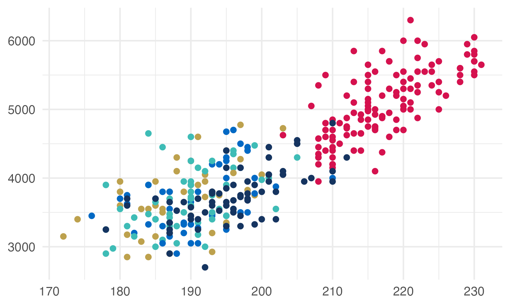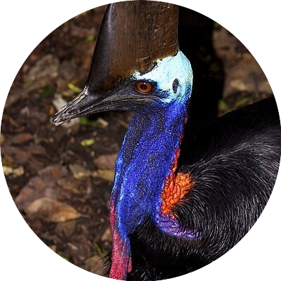

Image: [Nick
Hobgood](https://commons.wikimedia.org/wiki/File:Casuarius_casuarius_Southern_Cassowary_Papua_New_Guinea_by_Nick_Hobgood.jpg)

### Eastern Yellow Robin (*Eopsaltria australis*)


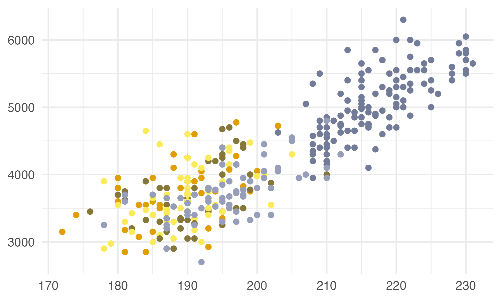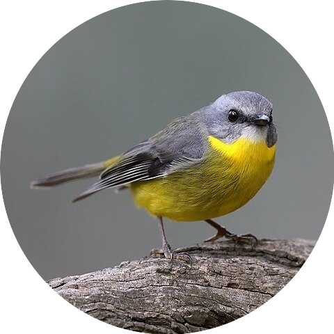

Image:
[Patrick_K59](https://commons.wikimedia.org/wiki/File:Eastern_Yellow_Robin_(Eopsaltria_australis)_(42280188404).jpg)

### Galah (*Eolophus roseicapilla*)


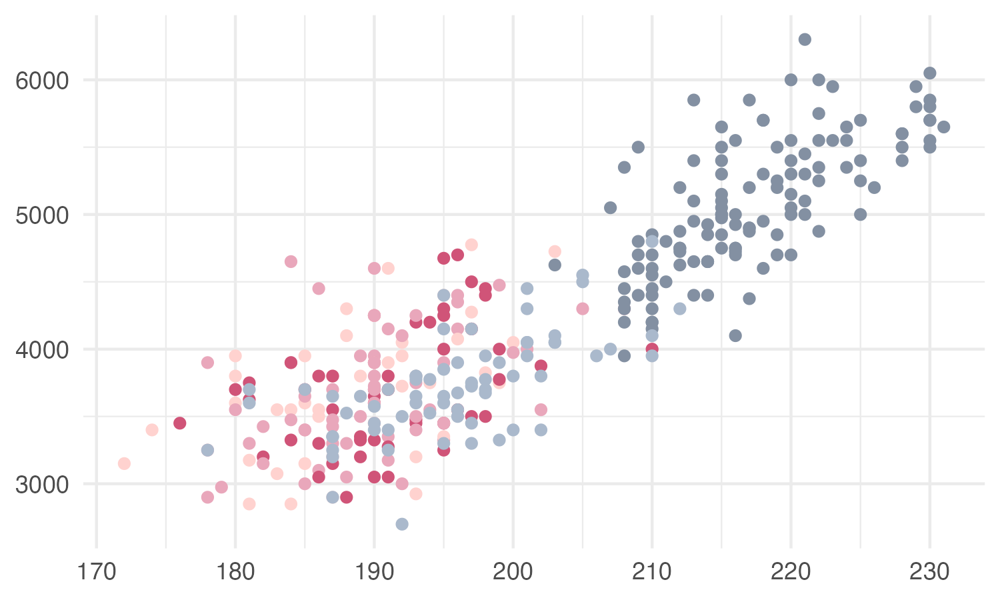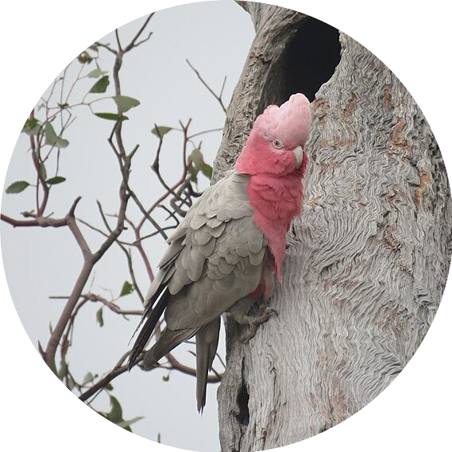

Image:
[Calistemon](https://commons.wikimedia.org/wiki/File:Galah_(Eolophus_roseicapilla)_at_Coalseam_Conservation_Park,_August_2022_16.jpg)

## Continuous palettes

The qualitative colour palettes in `feathers` may be converted into
sequential or diverging palettes for different types of data
visualisation using the `colorRampPalette()` function.

### Sequential palette

``` r
# choose end colours
seq_col <- get_pal("eastern_rosella")[c(2,7)]  

# create a gradient of 50 shades in between the selected colours 
colorRampPalette(seq_col)(50)
```


### Diverging palette

``` r
# choose end and middle colours
div_col <- get_pal("oriole")[c(1,5,10)]

# create a gradient of 50 shades in between the selected colours 
colorRampPalette(div_col)(50)
```


## Accessibility

There are many tools and packages which simulate different types of
colour vision deficiency, such as [Viz
Palette](https://projects.susielu.com/viz-palette),
[colorblindcheck](https://jakubnowosad.com/colorblindcheck/index.html),
[prismatic](https://emilhvitfeldt.github.io/prismatic/), and
[colorblindr](https://github.com/clauswilke/colorblindr). You may find
these helpful in guiding your decisions about which colours to include
in your visualisation to make it accessible to as many people as
possible. Happy plotting!

## Julia Port

These colour palettes are now available in Julia as part of the default
colour schemes
([ColorSchemes.jl](https://github.com/JuliaGraphics/ColorSchemes.jl/)).
Use these colour palettes as you would any other built-in Julia colour
scheme:

    using ColorSchemes
    colorscheme[:cassowary] # or your bird of choice

## Contribute

If you would like to contribute to this package or have suggestions for
improvement, please [contact me on
Bluesky](https://bsky.app/profile/shandiya.bsky.social) or submit a pull
request.
