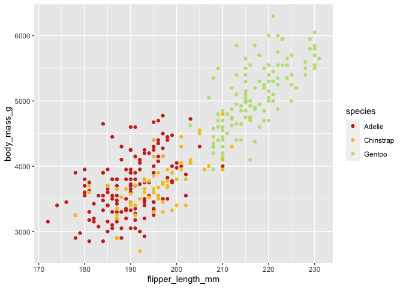
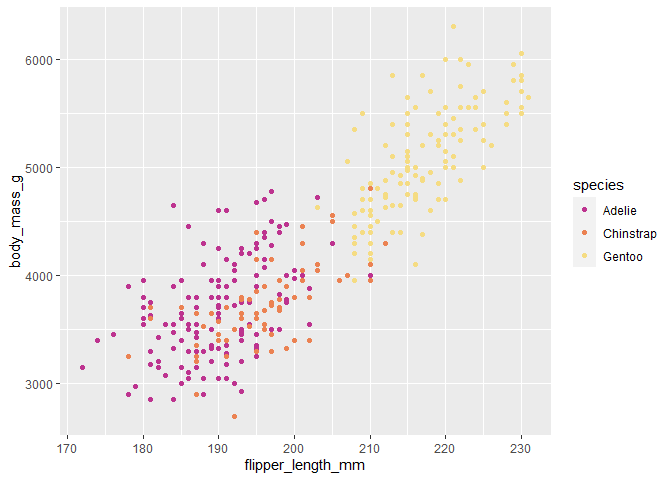
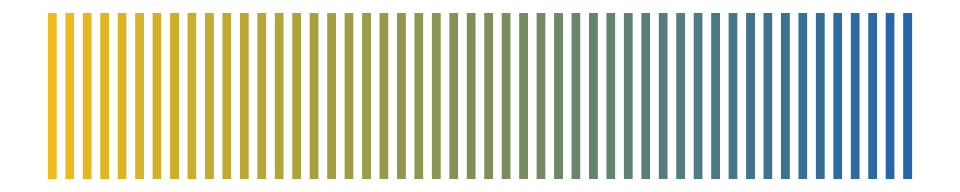
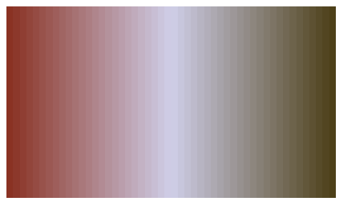

feather
================

This package contains colour palettes inspired by the plumage of
Australian birds. For species exhibiting sexual dimorphism (i.e. males
and females look different), I have used female colours. Research on
birds has historically been biased towards males, and the choice to use
female colours in this package is my way of highlighting the
often-overlooked beauty of female birds.

## Installation

This package is hosted on GitHub and can be installed using the devtools
package:

``` r
devtools::install_github("shandiya/feather")
```

## How to use `feather`

Colour palettes are stored as a list called `feather_palettes`, and can
be accessed thus:

``` r
library(feather)
names(feather_palettes)
```

    ## [1] "spotted_pardalote"       "plains_wanderer"        
    ## [3] "bee_eater"               "rose_crowned_fruit_dove"
    ## [5] "eastern_rosella"         "oriole"                 
    ## [7] "princess_parrot"         "gouldian_finch"

`get_pal` is a function that returns the chosen palette as a vector of
hex colour codes.

``` r
get_pal("eastern_rosella")
```

    ## [1] "#cd3122" "#f4c623" "#bee183" "#6c905e" "#2f533c" "#b8c9dc" "#2f7ab9"

`print_pal` is a function that displays the colour palette in the plots
pane.

``` r
eastern_rosella <- get_pal("eastern_rosella")
print_pal(eastern_rosella)
```


## Examples

Colour palettes can be used for data visualisation in base `R` and
`ggplot2`.

``` r
# base R
library(palmerpenguins)
plot(penguins$flipper_length_mm, penguins$body_mass_g, col = get_pal("rose_crowned_fruit_dove")[factor(penguins$species)], pch = 19)

# ggplot2
library(ggplot2)
library(palmerpenguins)
ggplot(penguins) +
  geom_point(aes(flipper_length_mm, body_mass_g, colour = species)) +
  scale_colour_manual(values = get_pal("rose_crowned_fruit_dove"))
```



## Colour palettes

The images below show each palette and the bird that inspired it.

### Eastern Rosella (*Platycercus eximius*)


Image:
[Mfunnell](https://commons.wikimedia.org/wiki/File:Eastern_Rosella_\(Platycercus_eximius\)_in_tree.jpg)

### Plains-wanderer (*Pedionomus torquatus*)


Image: [Dominic
Sherony](https://commons.wikimedia.org/wiki/File:Plains-wanderer_\(Pedionomus_torquatus\)_7_\(30547426803\).jpg)

### Spotted Pardalote (*Pardalotus punctatus*)


Image:
[Patrick\_K59](https://commons.wikimedia.org/wiki/File:Spotted_Pardalote_\(Pardalotus_punctatus\)_female_\(23113043855\).jpg)

### Rose-crowned Fruit-Dove (*Ptilinopus regina*)


Image:
[Moonlight0551](https://commons.wikimedia.org/wiki/File:Rose-crowned_Fruit-Dove_-_Ptilinopus_regina_\(7088988107\).jpg)

### Rainbow Bee-eater (*Merops ornatus*)


Image: [Jim
Bendon](https://commons.wikimedia.org/wiki/File:Rainbow_bee_eater_m%26f.jpg)

## Continuous palettes

The qualitative colour palettes in `feather` may be converted into
sequential or diverging palettes for different types of data
visualisation using the `colorRampPalette()` function.

### Sequential palette

``` r
# choose end colours
seq_col <- get_pal("eastern_rosella")[c(2,7)]

# create a gradient of 50 shades in between the selected colours 
colorRampPalette(seq_col)(50)
```



### Diverging palette

``` r
# choose end and middle colours
div_col <- get_pal("oriole")[c(1,5,10)]

# create a gradient of 50 shades in between the selected colours 
colorRampPalette(div_col)(50)
```



## Contribute

If you would like to contribute to this package or have suggestions for
improvement, please contact [ShandiyaB](https://twitter.com/ShandiyaB)
on Twitter or submit a pull request.
