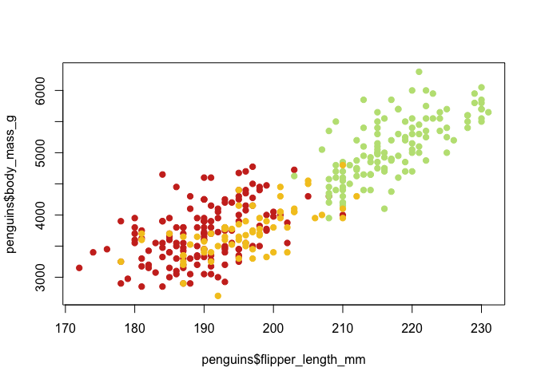
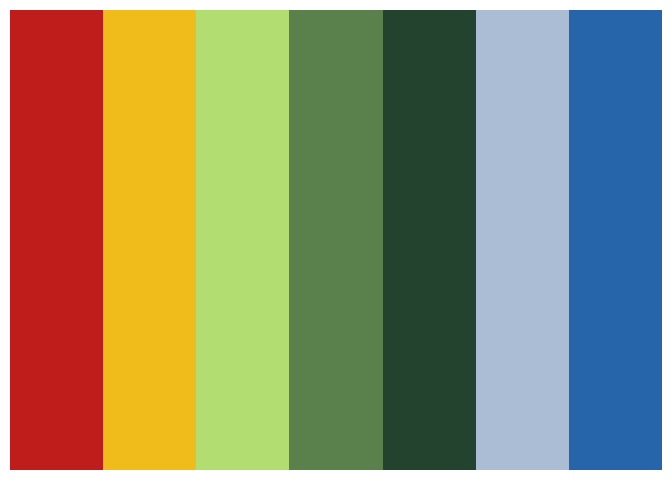
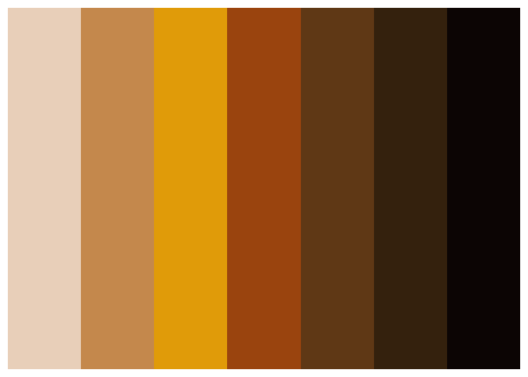
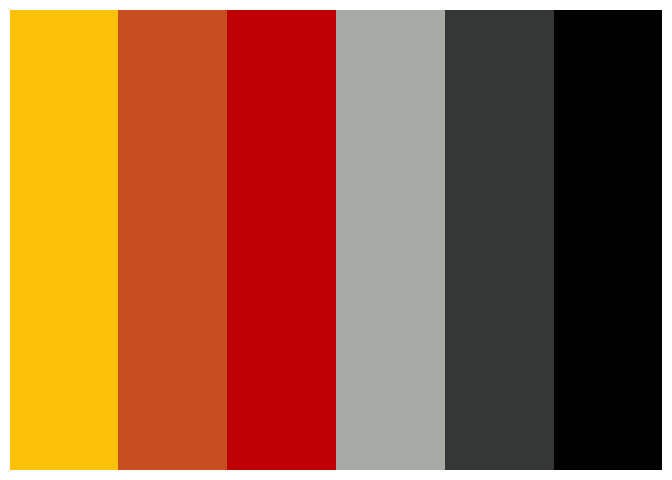
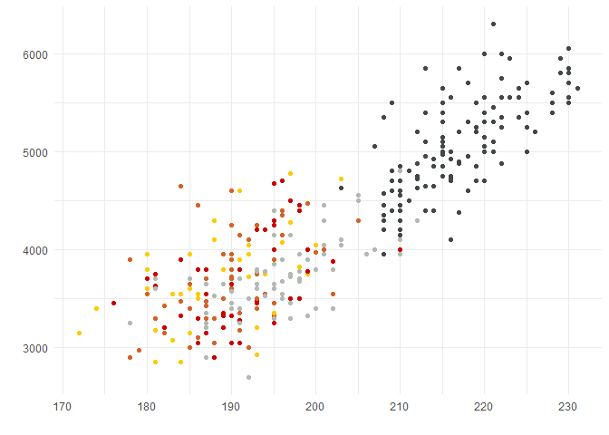
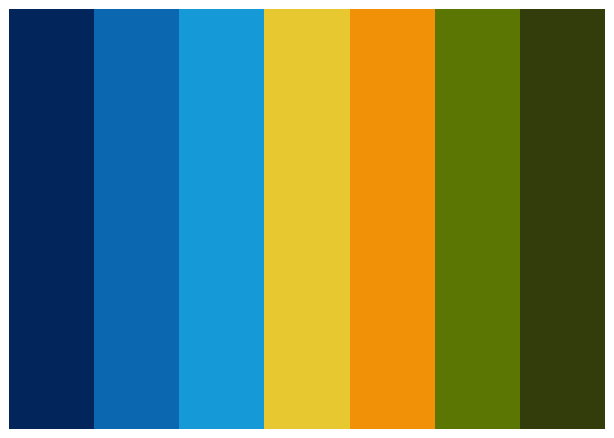

## Introduction

This package contains a selection of colour palettes inspired by the
plumage of Australian birds.

## Installation

This package is hosted on GitHub and can be installed using the devtools
package:

``` r
devtools::install_github("shandiya/feather")
```

## How to use `feather`

Colour palettes are stored as a list called `feather_palettes`, and can
be accessed thus:

``` r
library(feather)
names(feather_palettes)
```

    ## [1] "pardalote"               "plains_wanderer"        
    ## [3] "bee_eater"               "rose_crowned_fruit_dove"
    ## [5] "eastern_rosella"

`get_pal` is a function that returns the chosen palette as a vector of
hex colour codes.

``` r
get_pal("eastern_rosella")
```

    ## [1] "#cd3122" "#f4c623" "#bee183" "#6c905e" "#2f533c" "#b8c9dc" "#2f7ab9"

`print_pal` is a function that displays the colour palette in the plots
pane.

``` r
eastern_rosella <- get_pal("eastern_rosella")
print_pal(eastern_rosella)
```

<!-- -->

## Examples

`ggplot`:

``` r
library(palmerpenguins)
library(tidyverse)

ggplot(penguins) +
  geom_point(aes(flipper_length_mm, body_mass_g, colour = species)) +
  scale_colour_manual(values = get_pal("eastern_rosella"))
```

<!-- -->

base `R`:

``` r
library(palmerpenguins)
plot(penguins$flipper_length_mm, penguins$body_mass_g, col = get_pal("eastern_rosella")[factor(penguins$species)], pch = 19)
```

<!-- -->

# Colour palettes

The images below show each palette and the bird that inspired it.

## Eastern Rosella


Image credit: [JJ Harrison](https://www.jjharrison.com.au/). This file
is licensed under the [Creative
Commons](https://en.wikipedia.org/wiki/Creative_Commons)
[Attribution-Share Alike 3.0 Unported
license](https://creativecommons.org/licenses/by-sa/3.0/deed.en). Image
source: [Wikimedia
Commons](https://commons.wikimedia.org/wiki/File:Platycercus_eximius_diemenensis_male.jpg).

<!-- -->

## Plains wanderer


Image credit:
[Patrick\_K59](https://www.flickr.com/photos/patrick_k59/14368940377/).
This file is licensed under the CC BY 2.0,
<https://commons.wikimedia.org/w/index.php?curid=34831381>. Image
source: [Wikimedia
Commons](https://commons.wikimedia.org/wiki/File:Pedionomus_torquatus,_NSW_1.jpg).

<!-- -->

## Pardalote


Image credit: [Fir0002 - Own work, GFDL
1.2](https://commons.wikimedia.org/w/index.php?curid=1535942). This file
is licensed under the [Creative
Commons](https://en.wikipedia.org/wiki/Creative_Commons), [Attribution
NonCommercial Unported
3.0](https://creativecommons.org/licenses/by-nc/3.0/). Image source:
[Wikimedia
Commons](https://commons.wikimedia.org/wiki/File:Pardalotus_with_nesting_material.jpg).

<!-- -->

## Rose crowned fruit dove


Image credit: [Bjørn Christian
Tørrissen](http://bjornfree.com/galleries.html), CC BY-SA 3.0,
<https://commons.wikimedia.org/w/index.php?curid=6874281>

<!-- -->

## Bee eater


Image credit: [JJ Harrison](https://www.jjharrison.com.au/). This file
is licensed under the [Creative
Commons](https://en.wikipedia.org/wiki/Creative_Commons)
[Attribution-Share Alike 3.0 Unported
license](https://creativecommons.org/licenses/by-sa/3.0/deed.en). Image
source: [Wikimedia
Commons](https://commons.wikimedia.org/wiki/File:Merops_ornatus_-_Centenary_Lakes.jpg).

<!-- -->

## Contribute

If you would like to contribute to this package or have suggestions for
improvement, please contact
\[@ShandiyaB\](<https://twitter.com/ShandiyaB>) on Twitter or submit a
pull request.
"A line I wrote on my local computer" 
